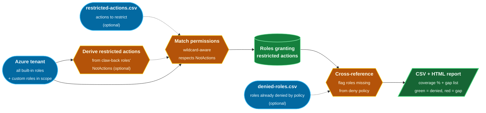

# RADAR - Restricted Action Detector for Azure Roles


RADAR is a PowerShell tool that identifies which **Azure RBAC roles** grant access to a defined list of **restricted actions**, the actions the team does not want anyone to be able to perform.

It takes a CSV of Azure RBAC actions to restrict and compares each one against the permissions of every built-in role (and optionally custom roles defined at a specific management group), honouring `Actions` and `NotActions`. The output is a CSV and a self-contained HTML report listing every role that grants any of the restricted actions, with the matched permission pattern shown alongside.

The restricted-action list can be supplied as a CSV or derived live from the `NotActions` of your "grant-all then claw-back" roles, so it never drifts from the policy it is meant to enforce (see [Deriving restricted actions dynamically](#deriving-restricted-actions-dynamically)).

When a list of roles already blocked by the deny policy is supplied, RADAR cross-references the matches against it and flags the roles that still need to be added, so the gap between RBAC reality and policy is visible in one place.

## How it works



The restricted actions (from the CSV, derived live from the claw-back roles, or both) are matched against the tenant's role data and folded into a single annotated report. Every matched role is listed, coloured green where the deny policy already covers it and red where it does not.

## Why RADAR?

Azure exposes hundreds of built-in roles, each granting dozens or hundreds of permissions, frequently via wildcards. Auditing them by hand to determine which expose sensitive operations such as `Microsoft.Authorization/roleAssignments/write` or `Microsoft.KeyVault/vaults/delete` is slow and error-prone. RADAR automates that audit:

- Detects exact and wildcard matches against the restricted-actions list (matching is bidirectional, so `Microsoft.Foo/*` in either the input or the role definition resolves correctly).
- Honours `NotActions` exclusions, so a role is not flagged for a permission it explicitly removes.
- Derives the restricted-action list live from your claw-back roles, so it never drifts as Azure adds or hardens built-in roles.
- Surfaces the delta between matched roles and the existing deny-policy coverage.
- Emits a CSV for pipeline consumption and a self-contained HTML report for review and sharing.

## Requirements

- PowerShell 7+ (or Windows PowerShell 5.1)
- [`Az.Resources`](https://learn.microsoft.com/powershell/module/az.resources/) PowerShell module
- An authenticated Azure context (`Connect-AzAccount`)
- Read access to role definitions in the tenant

## Repository layout

```
radar/
├── README.md                  # This file
├── Invoke-Radar.ps1           # Main script
├── restricted-actions.csv     # Input: actions to restrict
├── denied-roles.csv           # Optional: roles already denied by policy
└── output/                    # Generated reports (created at runtime)
```

## Input format

`restricted-actions.csv` is a single-column CSV listing the actions to flag:

```csv
Action
Microsoft.Authorization/roleAssignments/write
Microsoft.Authorization/roleAssignments/delete
Microsoft.KeyVault/vaults/delete
Microsoft.Storage/storageAccounts/listKeys/action
```

`denied-roles.csv` (optional) is a single-column CSV of role names already blocked by the deny policy:

```csv
RoleName
Owner
Contributor
User Access Administrator
```

## Usage

The simplest invocation accepts all defaults and presents an interactive menu when no scoping arguments are passed:

```powershell
Connect-AzAccount
./Invoke-Radar.ps1
```

The menu offers built-in only, or built-in plus custom roles authored at a management group entered at the prompt. When a management group is selected it also offers to derive the restricted actions dynamically from that group's claw-back roles (see [Deriving restricted actions dynamically](#deriving-restricted-actions-dynamically)). Pass `-NoMenu` to skip it. To run non-interactively with explicit paths:

```powershell
./Invoke-Radar.ps1 -InputCsv ./restricted-actions.csv `
                   -OutputCsv ./output/radar-report.csv `
                   -OutputHtml ./output/radar-report.html
```

`-OutputHtml` is optional; supply it to generate the styled HTML report alongside the CSV.

### Including custom roles

By default RADAR scans only built-in Azure roles. To also include custom roles defined at a specific management group, pass `-ManagementGroup`:

| Switch | Behaviour |
| --- | --- |
| `-ManagementGroup <name>` | In addition to built-in roles, scan custom role definitions whose `AssignableScopes` is exactly the named management group. Roles inherited from a parent scope are excluded. |

```powershell
# Built-in roles only
./Invoke-Radar.ps1 -InputCsv ./restricted-actions.csv `
                   -OutputCsv ./output/radar-report.csv `
                   -OutputHtml ./output/radar-report.html

# Built-in plus custom roles defined at a management group
./Invoke-Radar.ps1 -InputCsv ./restricted-actions.csv `
                   -OutputCsv ./output/radar-report.csv `
                   -OutputHtml ./output/radar-report.html `
                   -ManagementGroup <your-management-group>
```

Custom roles are visually distinguished in both reports: the CSV `IsCustom` column is `True`, and the HTML report renders an orange `Custom` badge plus a dedicated "Custom Scanned" summary card.

### Deriving restricted actions dynamically

Instead of maintaining `restricted-actions.csv` by hand, RADAR can build the restricted-action list at runtime from the live role definitions themselves. The model here grants `*` and claws permissions back via `NotActions`, so those `NotActions` *are* the canonical restricted set. `-DynamicRestrictedActions` reads them straight from Azure, so the scan always reflects the current roles rather than a list that can drift.

| Switch | Behaviour |
| --- | --- |
| `-DynamicRestrictedActions` | Derive the restricted actions from the `NotActions` of every "grant-all" custom role (those whose `Actions` is `*`) found at the `-ManagementGroup` scope. Requires `-ManagementGroup`. Can be combined with `-InputCsv`, in which case both sources are unioned. |
| `-RestrictedFromRoleNames <patterns>` | Optional. Narrow the derivation to specific role names (wildcards supported), e.g. `'Custom-Owner-*'`. When omitted, every wildcard role at the scope is used. |

```powershell
# Pull the restricted actions live from the wildcard claw-back roles at a management group
./Invoke-Radar.ps1 -DynamicRestrictedActions `
                   -ManagementGroup <your-management-group> `
                   -OutputCsv ./output/radar-report.csv `
                   -OutputHtml ./output/radar-report.html `
                   -DeniedRolesCsv ./denied-roles.csv
```

The console reports which roles the actions were derived from and the total count. It adds a little execution time (it reads the role definitions at the scope) but guarantees the list is never stale.

### Cross-referencing against the deny policy

When the team already maintains a list of role names blocked by Azure Policy or another deny mechanism, RADAR can flag any matched role that is not yet on it.

| Switch | Behaviour |
| --- | --- |
| `-DeniedRolesCsv <path>` | CSV with a single `RoleName` column. Each matched role is checked against this set; the report flags those not yet denied. If `denied-roles.csv` is present next to the script it is picked up automatically. |

```powershell
./Invoke-Radar.ps1 -InputCsv ./restricted-actions.csv `
                   -OutputCsv ./output/radar-report.csv `
                   -OutputHtml ./output/radar-report.html `
                   -ManagementGroup <your-management-group> `
                   -DeniedRolesCsv ./denied-roles.csv
```

When supplied:

- The CSV gains an `IsAlreadyDenied` column (`True`/`False`) per row.
- The HTML report adds the deny-policy coverage donut, the "Currently obtainable restricted actions" view, a green `Denied` or red `Not Denied` pill on each role section, and a left-edge bar coloured green (denied) or red (not yet denied).
- The console summary prints the role names that are not yet on the deny list, ready to be pasted into the policy.

## Output

The **CSV report** has one row per matched role-and-action pairing:

- `RoleName`, `RoleId`
- `IsCustom`
- `RestrictedAction`: the input action that triggered the match
- `MatchedPattern`: the permission entry on the role responsible for the match
- `IsAlreadyDenied`: populated when `-DeniedRolesCsv` is supplied

The **HTML report** is a self-contained dashboard (no external assets, so it can be shared as a single file). It includes:

- **Deny-policy coverage donut** - the percentage of affected roles already blocked by the deny policy, with the roles-affected, already-denied and still-to-deny counts alongside. Shown when `-DeniedRolesCsv` is supplied.
- **Summary cards** - Built-in Scanned, Custom Scanned (when a management group is in scope), Restricted Actions, and Source Roles (the wildcard roles the list was derived from in dynamic mode; hover to see their names).
- **Restricted actions evaluated** - the full list the scan checked against.
- **Currently obtainable restricted actions** - the subset still granted by at least one role not on the deny list, i.e. the actions a user who can assign roles could regain. Hover an action to see which roles grant it. Shown when `-DeniedRolesCsv` is supplied.
- **Per-role breakdown** - a collapsible section per matched role with a Built-in/Custom badge, a Denied/Not Denied pill, and a left-edge bar coloured green (denied) or red (not yet denied). An Expand all / Collapse all button and a client-side search filter (role name, action, or matched pattern) make it quick to navigate.

## Roadmap

- [x] Wildcard matching with `NotActions` exclusion
- [x] HTML report
- [x] Optional scan of custom roles in a management group
- [x] Cross-reference against an existing denied-roles list
- [x] Dynamic restricted-action derivation from claw-back roles' `NotActions`
- [x] Deny-policy coverage metric and obtainable-actions view
- [ ] Markdown report format
- [ ] CI-friendly exit codes for pipeline use

## License

Released under the [MIT License](LICENSE).
