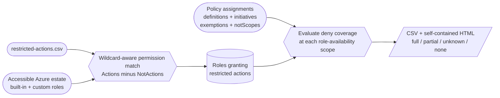

# RADAR - Restricted Action Detector for Azure Roles


RADAR identifies Azure RBAC roles that grant defined **restricted actions** and
compares those roles with the Azure Policies that block role assignment. It
then reports the restricted actions that remain obtainable through a role that
is not denied at every evaluated scope.

By default, RADAR discovers the management groups and subscriptions visible to
the current identity. It scans built-in and custom roles, direct policies and
initiatives, `notScopes`, and active policy exemptions without relying on a
customer-specific management group or policy name.

RADAR supports both the legacy flattened role model and the `Permissions[]`
model introduced by Az.Resources 10 / Azure PowerShell 16.

## How it works



The restricted-action list can come from a CSV, from the `NotActions` of broad
customer baseline roles, or from both sources. A role is counted as safely
denied only when an effective deny policy blocks it at **every** scope where the
role is available. Partial or uncertain coverage is treated as obtainable.

## Features

- Scans built-in and custom roles across an accessible customer estate.
- Uses Azure Resource Graph for tenant-wide custom-role discovery when
  available, with scoped Az.Resources queries as a fallback.
- Matches exact permissions and intersecting wildcards on either side.
- Supports role definitions returned by Az.Resources 9 and Az.Resources 10+.
- Honours `NotActions` when calculating effective control-plane permissions.
- Resolves direct policy definitions and initiative member policies.
- Distinguishes deny-lists from allow-lists rather than treating every policy
  parameter value as a blocked role.
- Resolves assignment parameters, definition defaults, parameterised effects,
  `notScopes`, `DoNotEnforce`, and active policy exemptions.
- Reports unsupported policy expressions as unknown coverage instead of
  silently claiming that a role is blocked.
- Emits a CSV and a self-contained HTML dashboard.

## Requirements

- PowerShell 7+ (Windows PowerShell 5.1 remains supported)
- [`Az.Accounts`](https://learn.microsoft.com/powershell/module/az.accounts/)
- [`Az.Resources`](https://learn.microsoft.com/powershell/module/az.resources/)
- [`Az.ResourceGraph`](https://learn.microsoft.com/powershell/module/az.resourcegraph/)
  is optional but recommended for estate-wide custom-role discovery
- An authenticated Azure context

The identity needs read access to the estate being assessed:

```text
Microsoft.Authorization/roleDefinitions/read
Microsoft.Authorization/policyDefinitions/read
Microsoft.Authorization/policySetDefinitions/read
Microsoft.Authorization/policyAssignments/read
Microsoft.Authorization/policyExemptions/read
Microsoft.Management/managementGroups/read
Microsoft.Resources/subscriptions/read
```

`Reader` at the customer root management group is the simplest way to provide
the necessary visibility. RADAR never creates, changes, or deletes Azure
resources.

### Azure Cloud Shell

Azure Cloud Shell already supplies PowerShell, Azure authentication, and the Az
modules:

```powershell
git clone https://github.com/danielfears/azure-radar.git
Set-Location ./azure-radar
./Invoke-Radar.ps1
```

Use the PowerShell Cloud Shell. Download the generated HTML and CSV before an
ephemeral session ends, or use a mounted Cloud Shell storage account.

## Repository layout

```text
azure-radar/
├── Invoke-Radar.ps1
├── Invoke-Radar.Tests.ps1
├── restricted-actions.csv
├── denied-roles.csv
├── README.md
└── output/                    # Created at runtime
```

## Input

`restricted-actions.csv` must contain an `Action` column:

```csv
Action
Microsoft.Authorization/roleAssignments/write
Microsoft.Authorization/roleAssignments/delete
Microsoft.KeyVault/vaults/delete
Microsoft.Storage/storageAccounts/listKeys/action
```

`denied-roles.csv` is an optional manual supplement. It must contain a
`RoleName` column:

```csv
RoleName
Owner
Contributor
User Access Administrator
```

The CSV supplement is used only when passed explicitly with
`-DeniedRolesCsv`; it is not loaded automatically. Listed roles are asserted to
be denied across the full assessed estate.

## Usage

The interactive default scans the accessible estate:

```powershell
Connect-AzAccount
./Invoke-Radar.ps1
```

For a non-interactive run:

```powershell
./Invoke-Radar.ps1 -NoMenu `
    -InputCsv ./restricted-actions.csv `
    -OutputCsv ./output/radar-report.csv `
    -OutputHtml ./output/radar-report.html
```

### Scope controls

| Parameter | Behaviour |
| --- | --- |
| No scope parameter | Discover accessible management groups and enabled subscriptions |
| `-Scope <id>[,<id>...]` | Scan explicit Azure resource scope IDs |
| `-ManagementGroup <name>` | Backwards-compatible shortcut for one management group |
| `-CurrentSubscriptionOnly` | Limit the scan to the current subscription |
| `-BuiltInOnly` | Skip custom-role discovery |

Examples:

```powershell
# One management group
./Invoke-Radar.ps1 -NoMenu `
    -ManagementGroup customer-root `
    -InputCsv ./restricted-actions.csv `
    -OutputCsv ./output/customer-root.csv

# Two explicit subscriptions
./Invoke-Radar.ps1 -NoMenu `
    -Scope /subscriptions/<SUBSCRIPTION_ID_1>,/subscriptions/<SUBSCRIPTION_ID_2> `
    -InputCsv ./restricted-actions.csv `
    -OutputCsv ./output/subscriptions.csv
```

An explicit management-group-only scan cannot enumerate every exemption below
that group through the Azure PowerShell API. RADAR therefore marks its discovery
incomplete and will not claim `Full` deny coverage. Use the default estate scan
or pass the descendant subscriptions explicitly when full coverage matters.

### Dynamic restricted actions

`-DynamicRestrictedActions` derives restricted actions from broad custom roles
that grant `*` and claw permissions back with `NotActions`. It does not require
a particular management group or customer-specific default role name.

Without `-BaselineRolePattern`, RADAR auto-detects Owner and Contributor role
families and selects the role with the fewest `NotActions` in each family. That
favours broad platform baselines over narrow workload roles that grant `*` but
claw back most Azure operations.

```powershell
# Auto-detect broad Owner/Contributor wildcard roles
./Invoke-Radar.ps1 -NoMenu `
    -DynamicRestrictedActions `
    -OutputCsv ./output/radar-report.csv `
    -OutputHtml ./output/radar-report.html

# Override auto-detection for differently named customer baseline roles
./Invoke-Radar.ps1 -NoMenu `
    -DynamicRestrictedActions `
    -BaselineRolePattern '*Platform Baseline Admin*' `
    -OutputCsv ./output/radar-report.csv `
    -OutputHtml ./output/radar-report.html
```

The interactive menu always keeps `restricted-actions.csv` as a safety baseline
and optionally augments it with dynamically derived actions. A non-interactive
automatic run also falls back to the bundled CSV if no usable baseline role is
visible, rather than failing with no actions to evaluate.

Combine `-DynamicRestrictedActions` with a custom `-InputCsv` to union both
sources. Use narrow explicit role-name patterns: purpose-built wildcard roles
often have broad `NotActions` lists that do not represent the customer's
restricted baseline.

### Policy discovery

Live policy discovery is enabled by default. RADAR:

1. Lists policy assignments effective at each role-availability scope.
2. Resolves direct definitions and initiative members.
3. Resolves assignment parameters and definition defaults.
4. Uses pinned/effective policy and initiative-member definition versions.
5. Evaluates deny conditions against every discovered role.
6. Applies policy mode, `EnforcementMode`, `notScopes`, and active exemptions.
7. Treats assignment overrides and resource selectors as unknown unless their
   effect can be proven safely.
8. Calculates whether each role is denied everywhere, denied at some scopes,
   not denied, or cannot be determined safely.

Use `-NoPolicyDiscovery` for a role-only scan or when relying entirely on an
explicit `-DeniedRolesCsv` supplement.

## Coverage states

| State | Meaning | Counted as obtainable |
| --- | --- | --- |
| `Full` | The role is blocked at every evaluated availability scope | No |
| `Partial` | The role is blocked at some scopes but available at others | Yes |
| `None` | No evaluated deny rule blocks the role | Yes |
| `Unknown` | A rule, override, exclusion, or discovery gap cannot be resolved safely | Yes |
| `NotEvaluated` | Live policy discovery was disabled | Yes |

The tool is deliberately conservative: only `Full` coverage removes a role
from the obtainable-action calculation.

## Output

The CSV has one row per matched role and restricted action:

- `RoleName`, `RoleId`, `IsCustom`
- `RestrictedAction`, `MatchedPattern`
- `IsAlreadyDenied` (`True` only for `Full` coverage)
- `DenyCoverage`
- `DeniedScopeCount`, `EvaluatedScopeCount`
- `BlockingPolicies`
- `UnblockedScopes`
- `CoverageWarnings`

The HTML report includes:

- estate, role, policy-rule, and exemption counts;
- scope-aware deny coverage;
- currently obtainable restricted actions;
- Full, Partial, Unknown, and Not Denied role badges;
- discovery warnings embedded in the report;
- searchable per-role permission matches.

## Safety and limitations

- Results are limited to scopes and objects readable by the current identity.
- Azure Resource Graph is eventually consistent. If it fails, RADAR falls back
  to live scoped role queries and surfaces any failed scopes.
- Policy expressions involving unsupported runtime fields or functions are
  reported as `Unknown`, never as fully denied.
- Definition-version ranges without an effective version, assignment resource
  selectors, and assignment overrides are reported as `Unknown`.
- Role-definition ABAC conditions are not evaluated against a particular
  request or principal. A conditional permission is treated as potentially
  obtainable.
- RADAR evaluates whether a role could grant an action and whether policy blocks
  assigning it. It does not determine which individual principals currently
  possess `roleAssignments/write`.
- The restricted-action matcher currently evaluates control-plane `Actions`;
  it does not assess `DataActions`.

## Testing

Tests require Pester 5:

```powershell
Invoke-Pester -Path ./Invoke-Radar.Tests.ps1 -Output Detailed
```

The suite runs offline with mocked Azure responses. It covers Az.Resources 9
and 10 role shapes, wildcard intersections, policy deny/allow lists,
initiatives, exemptions, partial scope coverage, and empty reports.

## Roadmap

- [x] Az.Resources 10 `Permissions[]` compatibility
- [x] Estate-wide custom-role discovery
- [x] Generic direct-policy and initiative deny discovery
- [x] Scope-aware coverage with `notScopes` and exemptions
- [x] Conservative unsupported-policy reporting
- [ ] Markdown report format
- [ ] CI-friendly exit codes

## Licence

Released under the [MIT Licence](LICENSE).
