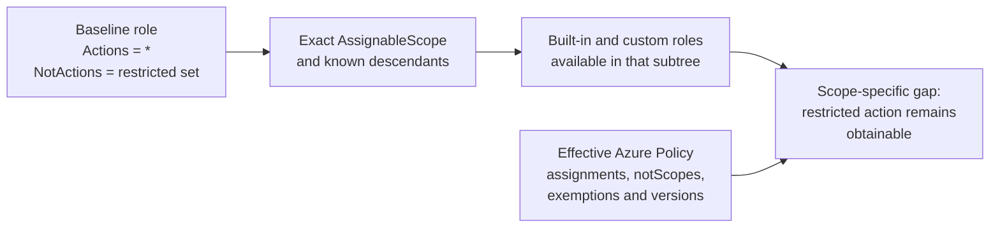

# RADAR - Restricted Action Detector for Azure Roles


RADAR performs scope-aware Azure RBAC gap analysis. It answers:

> A customer baseline role removes an action with `NotActions`. Can a principal
> regain that action through another role available in the same scope tree, and
> does Azure Policy actually block every relevant assignment route?

RADAR discovers the accessible estate, retains each baseline role and
`AssignableScope` as a separate security context, finds roles that grant the
baseline's restricted actions, and evaluates effective deny policies,
`notScopes`, exemptions, and direct/PIM assignment paths.

RADAR supports the legacy flattened role model and the `Permissions[]` model
introduced by Az.Resources 10 / Azure PowerShell 16.

## Analysis model



The semantic unit is:

```text
baseline role × baseline AssignableScope × restricted action × granting role
```

Baseline roles are never unioned. If production and UAT variants have the same
`NotActions`, production can be fully protected while UAT remains exposed, and
RADAR reports those independently.

An `AssignableScope` is treated as a subtree:

- A management-group scope includes known descendant management groups,
  subscriptions, resource groups, and resources.
- A subscription scope includes known descendant resource groups and resources.
- A resource-group scope includes known descendant resources.

RADAR discovers additional evaluation scopes from custom-role
`AssignableScopes`, policy assignments, policy `notScopes`, and policy
exemptions. Resource Graph provides the broad inventory; live ARM queries
confirm policy boundary scopes before a result can be considered fully covered.

## Features

- Discovers accessible management groups and enabled subscriptions.
- Scans built-in and custom roles using Azure Resource Graph, with a conservative
  Az.Resources fallback.
- Supports Az.Resources 9 and Az.Resources 10+ role object shapes.
- Matches exact permissions and intersecting wildcards in either direction.
- Performs exact wildcard set subtraction for `Actions`, `NotActions`, and the
  restricted pattern.
- Keeps separate `Permissions[]` blocks independent.
- Creates one dynamic baseline context per role and exact `AssignableScope`.
- Resolves direct policy definitions and initiative members.
- Resolves assignment parameters, defaults, effects, and pinned/effective
  definition versions.
- Distinguishes role deny-lists from role allow-lists.
- Applies policy mode, `EnforcementMode`, `notScopes`, and active exemptions at
  each exact evaluation scope.
- Treats overrides, selectors, unsupported expressions, failed scope queries,
  and unresolved hierarchy relationships as `Unknown`, never safely denied.
- Evaluates direct role assignment and any PIM assignment-request paths granted
  by the baseline role.
- Emits a detailed CSV and a self-contained HTML dashboard.

## Requirements

- PowerShell 7+; Windows PowerShell 5.1 remains supported
- [`Az.Accounts`](https://learn.microsoft.com/powershell/module/az.accounts/)
- [`Az.Resources`](https://learn.microsoft.com/powershell/module/az.resources/)
- [`Az.ResourceGraph`](https://learn.microsoft.com/powershell/module/az.resourcegraph/)
  is strongly recommended
- An authenticated Azure context

The identity needs read access to the estate:

```text
Microsoft.Authorization/roleDefinitions/read
Microsoft.Authorization/policyDefinitions/read
Microsoft.Authorization/policySetDefinitions/read
Microsoft.Authorization/policyAssignments/read
Microsoft.Authorization/policyExemptions/read
Microsoft.Management/managementGroups/read
Microsoft.Resources/subscriptions/read
```

`Reader` at the customer root management group is the simplest assignment.
Tenant Root Group access is not required: RADAR falls back to visible customer
roots when tenant-root hierarchy is unreadable.

RADAR never creates, updates, or deletes Azure resources.

## Azure Cloud Shell

PowerShell Cloud Shell already supplies Azure authentication and the Az modules:

```powershell
git clone https://github.com/danielfears/azure-radar.git
Set-Location ./azure-radar
./Invoke-Radar.ps1
```

Use mounted Cloud Shell storage for persistence, or download the generated CSV
and HTML before an ephemeral session ends.

Large estates can take time: policy assignments and exemptions are queried at
each relevant exact scope to prevent a parent result hiding a descendant gap.

## Repository layout

```text
azure-radar/
├── Invoke-Radar.ps1
├── Invoke-Radar.Tests.ps1
├── restricted-actions.csv
├── denied-roles.csv
├── README.md
└── output/                    # Created at runtime
```

## Inputs

### Restricted actions CSV

`restricted-actions.csv` must contain an `Action` column:

```csv
Action
Microsoft.Authorization/roleAssignments/write
Microsoft.Authorization/roleAssignments/delete
Microsoft.KeyVault/vaults/delete
Microsoft.Storage/storageAccounts/listKeys/action
```

CSV actions are an independent, estate-wide safety audit. They are **not**
attributed to, or unioned into, a particular dynamic baseline role.

### Denied roles CSV

`denied-roles.csv` is an optional manual assertion that named roles are blocked
throughout the assessed estate:

```csv
RoleName
Owner
Contributor
User Access Administrator
```

It is loaded only when passed explicitly with `-DeniedRolesCsv`. Live policy
discovery remains enabled unless `-NoPolicyDiscovery` is supplied.

## Usage

### Interactive estate scan

```powershell
Connect-AzAccount
./Invoke-Radar.ps1
```

The interactive menu keeps the bundled CSV safety audit and can additionally
enable dynamic baseline analysis.

### Full customer gap analysis

```powershell
./Invoke-Radar.ps1 -NoMenu `
    -DynamicRestrictedActions `
    -InputCsv ./restricted-actions.csv `
    -OutputCsv ./output/radar-report.csv `
    -OutputHtml ./output/radar-report.html
```

### Explicit customer baseline roles

Auto-detection selects every visible custom wildcard role with non-empty
`NotActions` and `Owner`, `Contributor`, or `Baseline` in its name. Every role
is analysed separately; their restrictions are never merged.

Use `-BaselineRolePattern` when customer naming differs or when only approved
canonical baselines should be analysed:

```powershell
./Invoke-Radar.ps1 -NoMenu `
    -DynamicRestrictedActions `
    -BaselineRolePattern 'Customer-Platform-Owner*','Customer-Platform-Contributor*' `
    -InputCsv ./restricted-actions.csv `
    -OutputCsv ./output/radar-report.csv `
    -OutputHtml ./output/radar-report.html
```

Patterns are authoritative and can match production and UAT variants. If
automatic discovery finds no baseline, RADAR falls back to the bundled CSV
instead of aborting.

Because role intent cannot be inferred perfectly from Azure metadata, inspect
the baseline-context list in the report. Use explicit patterns when a customer's
canonical roles are known.

### Scope controls

| Parameter | Behaviour |
| --- | --- |
| No scope parameter | Discover accessible management groups and enabled subscriptions |
| `-Scope <id>[,<id>...]` | Restrict discovery to explicit Azure scope IDs |
| `-ManagementGroup <name>` | Backwards-compatible shortcut for one management group |
| `-CurrentSubscriptionOnly` | Limit discovery to the current subscription |
| `-BuiltInOnly` | Skip custom roles; incompatible with dynamic baselines |

Examples:

```powershell
# One customer management group
./Invoke-Radar.ps1 -NoMenu `
    -ManagementGroup customer-root `
    -DynamicRestrictedActions `
    -OutputCsv ./output/customer-root.csv

# Two subscriptions
./Invoke-Radar.ps1 -NoMenu `
    -Scope /subscriptions/<SUBSCRIPTION_ID_1>,/subscriptions/<SUBSCRIPTION_ID_2> `
    -DynamicRestrictedActions `
    -OutputCsv ./output/subscriptions.csv
```

If management-group ancestry above an accessible customer root cannot be read,
RADAR keeps that relationship unresolved and fails open. It never assumes the
customer root is unrelated to an unreadable parent.

## Policy and assignment-path evaluation

For each relevant exact scope, RADAR:

1. Gets effective policy assignments at that scope and its ancestors.
2. Resolves direct definitions and initiative members.
3. Resolves parameters, effects, and effective definition versions.
4. Rejects `Indexed` definitions for role-assignment enforcement.
5. Applies `DoNotEnforce`, `notScopes`, and active exact-scope exemptions.
6. Marks selectors, overrides, and unsupported runtime expressions as unknown.
7. Evaluates the granting role against:
   - direct `Microsoft.Authorization/roleAssignments`;
   - PIM active assignment requests, when the baseline can create them;
   - PIM eligible assignment requests, when the baseline can create them.

A role is `Full` only when every relevant scope and every available assignment
path is definitely blocked. One unblocked or uncertain path keeps the action
obtainable.

`-NoPolicyDiscovery` performs role matching without claiming policy coverage.

## Coverage states

| State | Meaning | Counted as obtainable |
| --- | --- | --- |
| `Full` | Every relevant scope and assignment path is definitely blocked | No |
| `Partial` | Some relevant scopes are blocked and others remain open | Yes |
| `None` | No evaluated deny rule blocks every required path | Yes |
| `Unknown` | Coverage cannot be proven at one or more relevant scopes | Yes |
| `NotEvaluated` | Live policy discovery was disabled | Yes |

Completeness is scope-local. A failed query in subscription B does not downgrade
a fully proven result in unrelated subscription A.

## Output

The detailed CSV contains:

- `AnalysisMode`
- `BaselineRoleName`, `BaselineRoleId`, `BaselineScope`
- `RestrictionSource`
- `AssignmentPath`
- `RoleName`, `RoleId`, `IsCustom`
- `RestrictedAction`, `MatchedPattern`
- `IsAlreadyDenied`, `DenyCoverage`
- `DeniedScopeCount`, `EvaluatedScopeCount`
- `BlockingPolicies`
- `DeniedScopes`, `UnblockedScopes`
- `UnblockedAssignmentPaths`
- `CoverageWarnings`

The HTML report includes:

- role, policy, exemption, scope, and baseline-context counts;
- per-baseline obtainable-action totals;
- an explicitly labelled estate-wide union;
- source baseline and scope on every granting-role section;
- full, partial, unknown, and not-denied badges;
- blocking policy names and assignment scopes;
- unblocked assignment paths;
- embedded discovery warnings and searchable findings.

## Interpretation

RADAR is a **latent capability** analysis. A finding means an available role can
grant an action that a baseline removes and policy does not conclusively block
throughout the relevant subtree.

RADAR does not claim that a specific person has already exploited that path.
The `AssignmentPath` field indicates whether the baseline itself can create
direct/PIM assignments or whether another principal or delivery process is
required.

## Safety and limitations

- Results are limited to objects readable by the current identity.
- Azure metadata cannot prove which wildcard role represents business intent;
  explicit baseline patterns are recommended for known customers.
- Resource Graph is eventually consistent, so live ARM queries independently
  confirm descendant policy and exemption boundary scopes.
- Conditional role-definition permissions are treated as potentially
  obtainable because request attributes are unknown.
- Unsupported policy logic remains `Unknown`.
- `DataActions` are not currently analysed.
- Actual principal/group membership and existing combined role assignments are
  not correlated; this is capability analysis rather than a principal audit.

## Testing

Tests require Pester 5:

```powershell
Invoke-Pester -Path ./Invoke-Radar.Tests.ps1 -Output Detailed
```

The offline suite covers:

- Az.Resources 9 and 10 role shapes;
- cross-position wildcard intersection and exact wildcard subtraction;
- independent permission blocks;
- management-group hierarchy and fallback roots;
- separate production/UAT baseline contexts;
- direct and PIM assignment paths;
- direct policies, initiatives, allow-lists, versions, selectors, overrides,
  `notScopes`, and exemptions;
- scope-local incomplete discovery;
- empty CSV/HTML reports.

## Roadmap

- [x] Az.Resources 10 `Permissions[]` compatibility
- [x] Estate-wide custom-role discovery
- [x] Per-role, per-AssignableScope baseline contexts
- [x] Scope-specific policy gap analysis
- [x] Direct and PIM assignment-path coverage
- [x] Scope-local conservative failure handling
- [ ] Optional principal/role-assignment correlation
- [ ] Markdown report format
- [ ] CI-friendly exit codes

## Licence

Released under the [MIT Licence](LICENSE).
